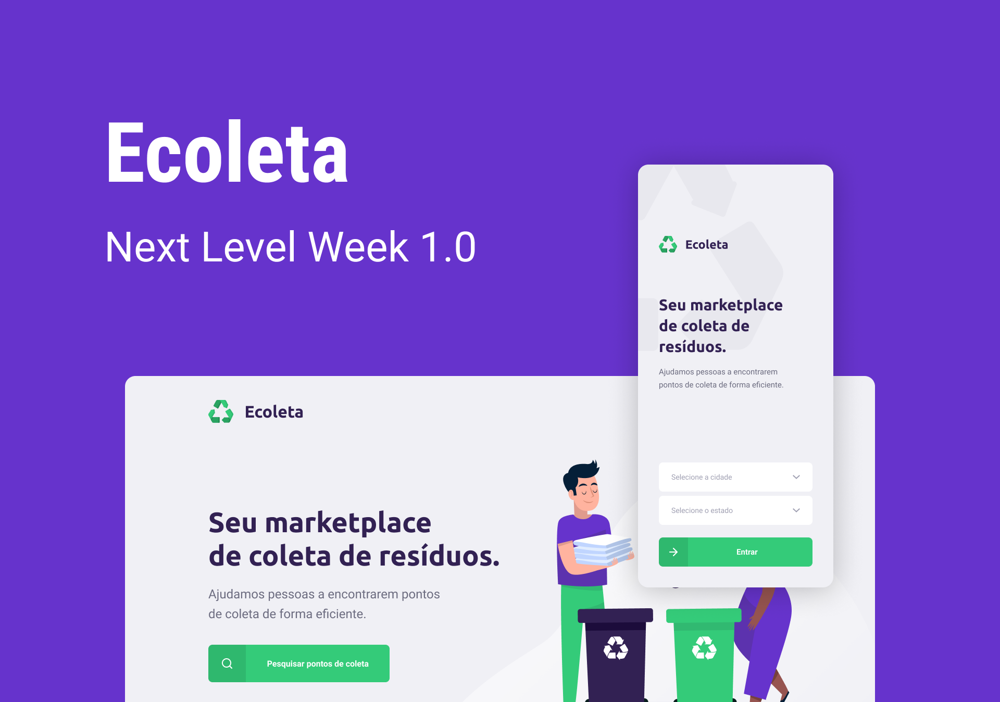

<h1 align = "center">
    
</h1>

<br>

<h3 align = "center">

[Como Usar](#-como-usar) | 
[Tecnologias](#-tecnologias)

</h3>

<br>

## 🔖 Descrição

<h4 align = "center">
♻ Durante o Next Level Week da Rockeseat desenvolvemos uma aplicação web (Front-end e Back-end integrado com uma API RESTFul) e mobile chamada "Ecoleta" que tem como intuito o cadastro de estabelecimentos que realizam a coletas de resíduos, auxiliando de forma eficiente a destinação correta de tais resíduos.
</h3>

<br>

<h1 align = "center">
    
</h1>

<h2 align = "center">
    
</h2>

<br>

## ℹ️ Como usar

Clone do repositório
```bash 
$ git clone https://github.com/JWCosta/next-level-week.git 
$ cd next-level-week
```
Após entrar na pasta do projeto, você deverá instalar as dependências das seguintes formas:
```bash 
#Install dependencies back-end
$ cd server
$ npm install ou yarn install
$ npm run dev
```
```bash 
#Install dependencies front-end 
$ cd web $ npm install ou yarn install
$ npm start ou yarn start
```
```bash 
#Install dependencies mobile
$ cd mobile
$ npm install ou yarn install
$ npm start ou yarn start ou expo start
```

<br>

## 💻 Tecnologias

- <a href="https://www.typescriptlang.org/">TypeScript</a>
- <a href="https://nodejs.org/en/">Node js</a>
- <a href="https://www.sqlite.org/index.html">Sqlite</a>
- <a href="https://expressjs.com/pt-br/">Express</a>
- <a href="http://knexjs.org/">Knex query builder</a>
- <a href="https://www.npmjs.com/package/cors">Cors</a>
- <a href="https://www.npmjs.com/package/multer">Multer</a>
- <a href="https://pt-br.reactjs.org/">React js</a>
- <a href="https://www.npmjs.com/package/react-router-dom">React router dom</a>
- <a href="https://react-dropzone.js.org/">React Dropzone</a>
- <a href="https://reactnative.dev/">React Native</a>
- <a href="https://reactnavigation.org/">React navigation</a>
- <a href="https://leafletjs.com/">Leaflet</a> e <a href="https://react-leaflet.js.org/docs/en/installation">React leaflet</a> para a integração do mapa
- <a href="https://www.npmjs.com/package/axios">Axios</a>
- <a href="https://servicodados.ibge.gov.br/api/docs/localidades?versao=1#api-_">Api IBGE</a> para listar corretamente os estados e cidades
- <a href="https://expo.io/">Expo</a>
- <a href="https://docs.expo.io/versions/latest/sdk/mail-composer/">Expo mail composer</a>
- <a href="https://docs.expo.io/versions/latest/sdk/location/">Expo location</a>
- <a href="https://www.npmjs.com/package/celebrate">Celebrate</a>
- <a href="https://nodejs.org/api/crypto.html">Crypto</a>

<br>
<br>
<hr>

<h3 align = "center"> Feito com 💚 por <a href="https://linkedin.com/in/jonathan-ws-costa">Jonathan Costa </a></h3>
